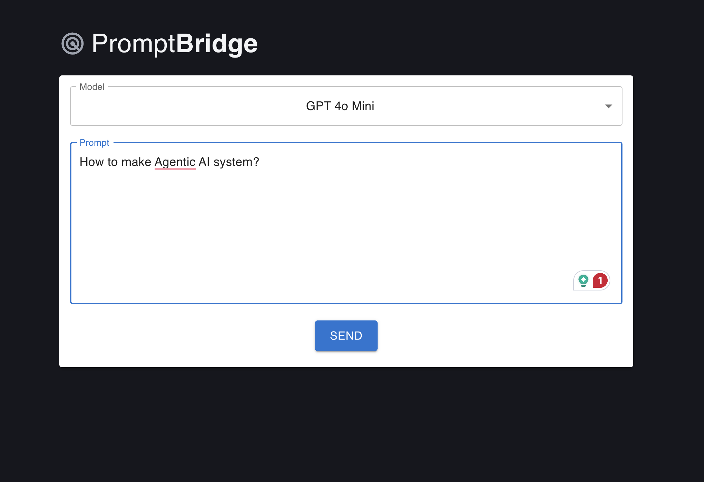
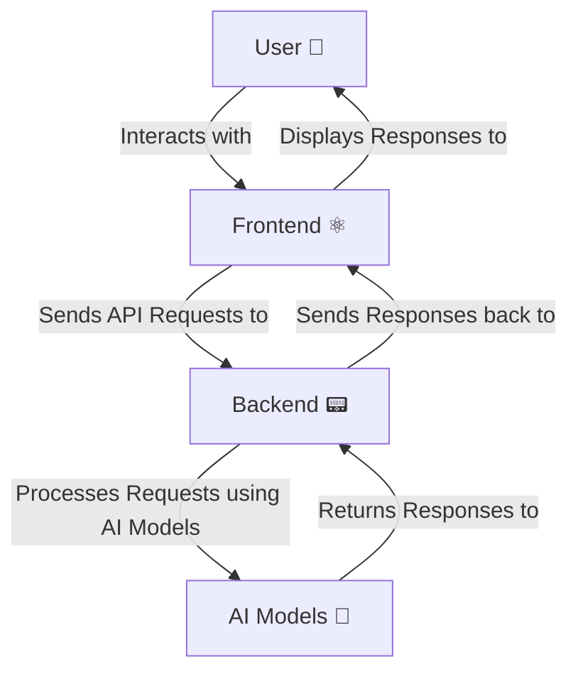

# PromptBridge ⛩️

> Open AI Python general purpose assistant using Python & React






---

## ⚛️ FRONTEND
> lives under [/frontend](./frontend) folder

Use existing UI or create your own to interact with the backend API.

```bash
npm create vite@latest frontend -- --template react

# install MUI or any other UI library you prefer
npm install @mui/material @emotion/react @emotion/styled @mui/icons-material

```
---

## 📟 Python AI Backend
> lives under [/backend](./backend) folder

## ⚙️ Installation
- Install [Python 3.10+](https://www.python.org/downloads/)
- Install [pip](https://pip.pypa.io/en/stable/installation/)

```bash
python3 -m pip install --upgrade pip
python3 -m pip install --upgrade build

```

## 👨🏻‍💻 Developer Setup

```bash
cd backend

python3 -m venv .venv
source .venv/bin/activate

```

🔑 Add [OpenAI API key](https://platform.openai.com/settings/organization/api-keys) to `backend/.env` file as environment variables

### 🪢 Dependencies

Install dependencies from `requirements.txt`:

```bash
python -m pip install -r requirements.txt
```

Don’t forget to freeze the new dependencies if you add any:

```bash
python -m pip freeze > requirements.txt

```

----

## 🧪 Run Backend Tests

```bash
  # Run Tests
  python -m pytest

  # Run tests with coverage
  python -m pytest --cov=src
  
  # With HTMl Report
  python -m pytest --cov=src --cov-report=html
  
  # Run Only Unit Tests
  python -m pytest -m "not integration"
  
  # Run Only Integration Tests
  python -m pytest -m "integration"

```

----

## ▶️ Start Backend

```bash
uvicorn backend.src.server:app --reload --port 8000

```

Backend will start at [http://localhost:8000](http://localhost:8000) and will be ready to accept API requests from the frontend.

API docs will be available at: [http://localhost:8000/docs](http://localhost:8000/docs)

## ▶️ Start Frontend

Install dependencies before starting the frontend server:

```bash
cd frontend
npm install
```

Finally, run the application:

```bash
npm run dev 
```


Frontend will run at: [http://localhost:5173](http://localhost:5173) and will be ready to interact with the backend API.

----


